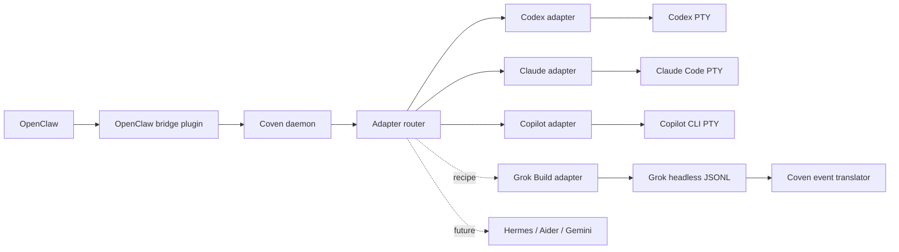

A **harness** is an external coding-agent CLI that Coven can launch and supervise inside an explicit project root. Coven owns the process transport, session record, and event log; the harness owns the conversation, tool calls, and provider authentication. Interactive adapters use a PTY, while reviewed finite headless protocols such as Grok Build use structured pipes.

<Columns>
  <Card title="Codex" href="/harnesses/codex" icon="binary">
    OpenAI Codex CLI. Harness id `codex`.
  </Card>
  <Card title="Claude Code" href="/harnesses/claude-code" icon="brain">
    Anthropic Claude Code. Harness id `claude`.
  </Card>
  <Card title="Copilot CLI" href="/harnesses/copilot-cli" icon="github">
    GitHub Copilot CLI. Harness id `copilot`.
  </Card>
  <Card title="Grok Build (experimental)" href="/harnesses/grok-build" icon="terminal">
    Trusted xAI Grok Build recipe. Installable harness id `grok`.
  </Card>
  <Card title="OpenClaw bridge" href="/harnesses/openclaw" icon="plug">
    External ACP runtime bridge through external OpenClaw bridge plugin.
  </Card>
  <Card title="Future harnesses" href="/FUTURE-HARNESSES" icon="compass">
    Hermes, Aider, Gemini CLI, Cline — adapter direction and roadmap signals.
  </Card>
</Columns>

## What Coven supervises



## What every harness has in common

- A stable **harness id** that clients pass to `coven run` or `POST /api/v1/sessions`.
- A guaranteed launch inside a canonical **project root**.
- A Coven-owned process transport: a PTY for interactive I/O and `coven attach`, or a reviewed structured pipe for finite headless runs.
- An append-only event stream stored under the session id.
- The same **rituals**: archive, summon, sacrifice.

## What stays with the harness

- **Provider auth.** Coven does not store API keys or OAuth tokens. `codex login`, `claude doctor`, and `copilot login` keep working as they did before.
- **Conversation state.** The harness owns its own prompt cache, system prompt, and tool registry.
- **Tool execution.** Tools run in-process inside the harness; Coven's job is to give it a clean PTY and a project-rooted cwd.

See [Provider auth boundary](/harnesses/provider-auth) for the credential-isolation rationale.

## Installing a harness CLI

<Steps>
  <Step title="Install one">
    ```bash
    npm install -g @openai/codex
    # or
    npm install -g @anthropic-ai/claude-code
    # or
    npm install -g @github/copilot
    ```
  </Step>
  <Step title="Finish provider auth">
    ```bash
    codex login
    claude doctor
    copilot login
    ```
  </Step>
  <Step title="Verify Coven sees it">
    ```bash
    coven doctor
    ```
  </Step>
</Steps>

If `coven doctor` reports a harness as missing, see [Installing harness CLIs](/harnesses/installing).

Grok Build is an experimental opt-in recipe rather than a bundled default. See [Grok Build](/harnesses/grok-build) for its separate CLI and adapter installation steps.

## Related

- [Provider auth boundary](/harnesses/provider-auth)
- [OpenClaw bridge](/harnesses/openclaw)
- [Grok Build adapter](/harnesses/grok-build)
- [Harness adapter guide](/HARNESS-ADAPTERS)
- [Future harness notes](/FUTURE-HARNESSES)
